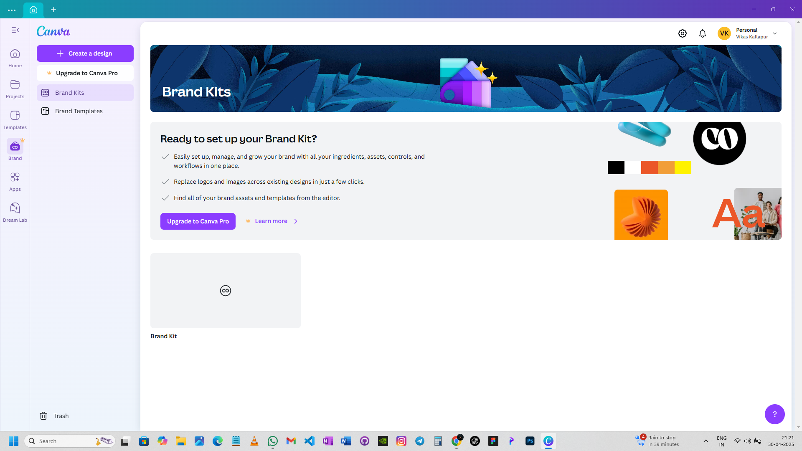

# Nessus Vulnerability Scan

## Objective
Perform vulnerability scanning using Nessus.

## Steps
1. Installed Nessus
2. Configured scan
3. Ran scan

## Results
(Add screenshots here)

## Conclusion
System vulnerabilities identified and analyzed.

